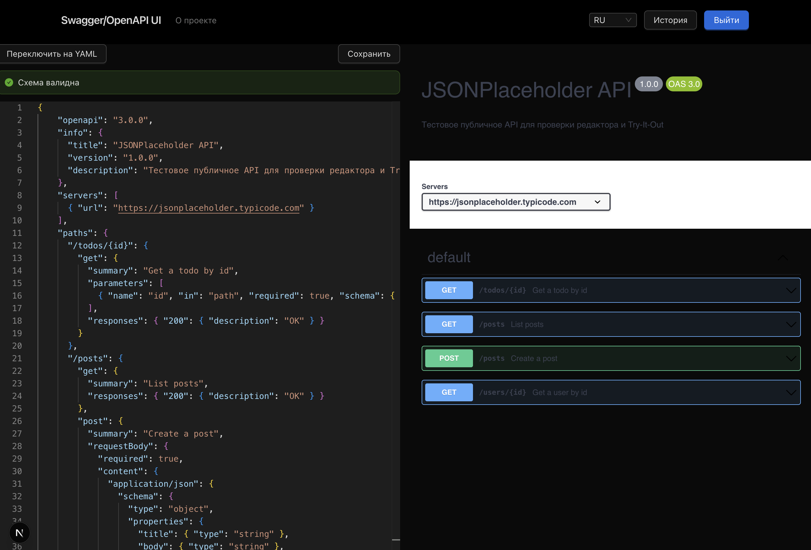
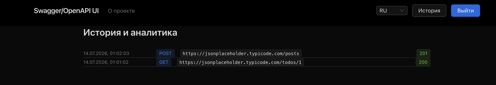

# Swagger/OpenAPI UI

Swagger/OpenAPI editor, viewer and REST client in a single app. Paste or write an OpenAPI/Swagger
specification (JSON or YAML), explore the generated endpoint list, and execute real requests
against any user-specified API directly from the browser — all requests are proxied through the
server to avoid CORS issues.

## Screenshots

Editor + Viewer, after pasting the example schema below and executing a request via Try-It-Out:



History & Analytics, listing the executed request with its method, URL and status:



## Try it yourself

Paste this OpenAPI schema into the editor on the home page — it points at the public
[JSONPlaceholder](https://jsonplaceholder.typicode.com/) API, so every endpoint can be executed
via Try-It-Out immediately, without needing an API key or your own server:

```json
{
  "openapi": "3.0.0",
  "info": {
    "title": "JSONPlaceholder API",
    "version": "1.0.0",
    "description": "Test public API for trying out the editor and Try-It-Out"
  },
  "servers": [{ "url": "https://jsonplaceholder.typicode.com" }],
  "paths": {
    "/todos/{id}": {
      "get": {
        "summary": "Get a todo by id",
        "parameters": [
          { "name": "id", "in": "path", "required": true, "schema": { "type": "integer" } }
        ],
        "responses": { "200": { "description": "OK" } }
      }
    },
    "/posts": {
      "get": {
        "summary": "List posts",
        "responses": { "200": { "description": "OK" } }
      },
      "post": {
        "summary": "Create a post",
        "requestBody": {
          "required": true,
          "content": {
            "application/json": {
              "schema": {
                "type": "object",
                "properties": {
                  "title": { "type": "string" },
                  "body": { "type": "string" },
                  "userId": { "type": "integer" }
                }
              }
            }
          }
        },
        "responses": { "201": { "description": "Created" } }
      }
    },
    "/users/{id}": {
      "get": {
        "summary": "Get a user by id",
        "parameters": [
          { "name": "id", "in": "path", "required": true, "schema": { "type": "integer" } }
        ],
        "responses": { "200": { "description": "OK" } }
      }
    }
  }
}
```

After executing a request, sign in and visit `/history` to see it recorded with its method, URL,
status code, duration, and request/response size.

## Tech stack

- **Framework:** [Next.js](https://nextjs.org/) (App Router), SSR/Route Handlers for proxying API requests
- **Auth & data:** [Firebase](https://firebase.google.com/) (Authentication + Firestore)
- **Editor:** [Monaco Editor](https://microsoft.github.io/monaco-editor/) (`@monaco-editor/react`)
- **Viewer / Try-It-Out:** [`swagger-ui-react`](https://github.com/swagger-api/swagger-ui)
- **Schema parsing/conversion:** `js-yaml`, `@apidevtools/swagger-parser`
- **i18n:** [`next-intl`](https://next-intl.dev/) (English / Russian)
- **Styling:** Tailwind CSS
- **Forms & validation:** React Hook Form + Zod
- **Testing:** Vitest + React Testing Library (unit/integration), Playwright (e2e)
- **Tooling:** ESLint, Prettier, Husky + lint-staged

## Requirements

- Node.js **>= 22** (see `.nvmrc`)
- Yarn (classic, v1)

## Getting started

```bash
# use the correct Node version (if you use nvm)
nvm use

# install dependencies
yarn install

# copy env template and fill in your Firebase project credentials
cp .env.example .env.local

# start the dev server
yarn dev
```

The app is available at [http://localhost:3000](http://localhost:3000) and redirects to a locale
route (`/en` or `/ru`).

## Scripts

| Command                        | Description                           |
| ------------------------------ | ------------------------------------- |
| `yarn dev`                     | Start the dev server (Turbopack)      |
| `yarn build`                   | Production build                      |
| `yarn start`                   | Start the production server           |
| `yarn lint` / `lint:fix`       | Run ESLint                            |
| `yarn format` / `format:check` | Run Prettier                          |
| `yarn typecheck`               | Run the TypeScript compiler (no emit) |
| `yarn test`                    | Run unit/integration tests (Vitest)   |
| `yarn test:coverage`           | Run tests with coverage report        |
| `yarn e2e`                     | Run end-to-end tests (Playwright)     |

## Environment variables

See `.env.example` for the full list. You will need a Firebase project with **Authentication**
(email/password provider) and **Firestore** enabled; the client variables come from the Firebase
web app config, the admin variables come from a generated service account JSON key.

## Known issues

- **`ParameterRow` legacy lifecycle warning in the dev console.** When using Try-It-Out in the
  Viewer, `swagger-ui-react` (specifically its internal `ParameterRow` component) logs:
  `Using UNSAFE_componentWillReceiveProps in strict mode is not recommended...`. This originates
  entirely from the `swagger-ui-react` dependency, not from this project's own code — this repo
  contains no class components. It is a known, still-unresolved upstream issue
  ([swagger-api/swagger-ui#10648](https://github.com/swagger-api/swagger-ui/issues/10648),
  [#10212](https://github.com/swagger-api/swagger-ui/issues/10212)) caused by React's
  `StrictMode` (enabled by default in Next.js) flagging a legacy lifecycle method still present in
  swagger-ui's core. It only appears in development (`yarn dev`), never in a production build, and
  has no effect on functionality. Disabling `reactStrictMode` would silence it but was rejected, as
  it would also remove StrictMode's protections for this project's own code. Tracked upstream; will
  be removed automatically once `swagger-ui-react` migrates away from the legacy lifecycle method.
